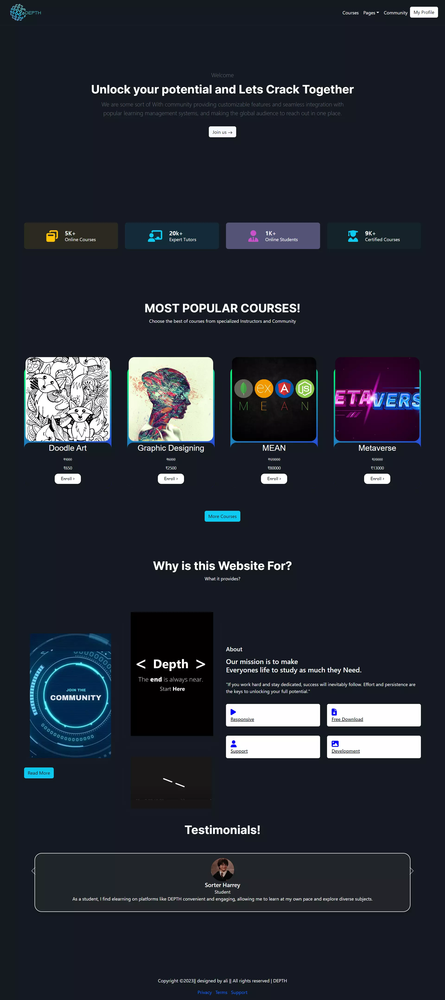

<h2>About the project</h2>

  
A <b>car rental</b> website is an online platform that allows users to rent cars for personal or business use. The website provides an easy-to-use interface for searching, comparing, and reserving cars from a wide selection of vehicles that vary in make, model, size, and price.

👉 Live Demo: <a href='https://alisprofile.github.io/Depth/'>Live Demo</a>

<h3>Build with:</h3>

» Sass / Scss  
» React JS

<h2>Screenshots of the Project 📸</h2>
 
<h3 align='center'>Home Page 🏡</h3>

